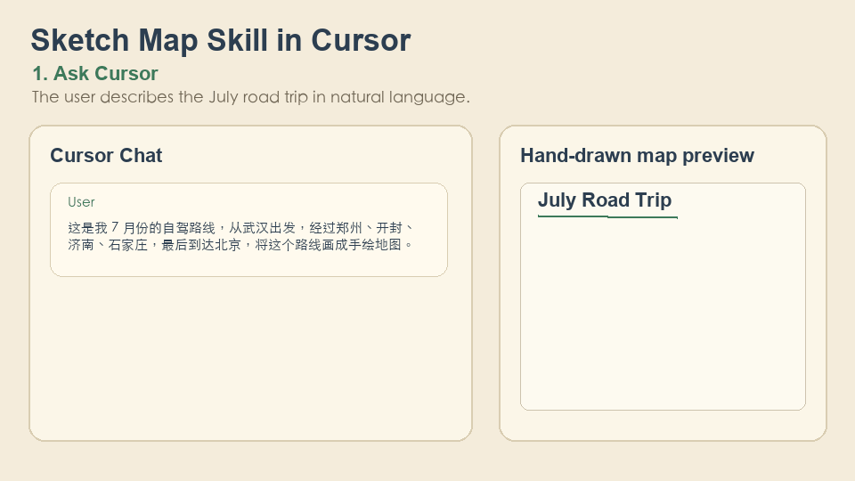

# sketch-map-skill

Portable **Agent skill** + CLI for generating hand-drawn China travel-route maps as PNG files. It uses [`sketch-map-sdk`](https://www.npmjs.com/package/sketch-map-sdk) for rendering and works with agents that can load `SKILL.md`-style instructions and run local commands.

## Demo



## Try in the browser

The companion **[sketch-map-app](https://github.com/dcheng666666/sketch-map-app)** SPA is published on GitHub Pages—open the **[live site](https://dcheng666666.github.io/sketch-map-app/)** to search places, reorder stops, preview the map, and download a PNG without installing this repo. Use the **[bundled sample route](https://dcheng666666.github.io/sketch-map-app/#sample)** to load a fixture instantly.

## What It Does

This skill helps a agent turn a route request into a hand-drawn map. The generated PNG can include:

- province watercolor washes
- rivers through the selected cities
- highlighted city polygons
- route arrows and numbered markers
- a compass and optional title

Example user prompt:

> 这是我 7 月份的自驾路线，从武汉出发，经过郑州、开封、济南、石家庄，最后到达北京，将这个路线画成手绘地图。

The agent should collect or infer WGS84 coordinates, write a route JSON file, run the CLI, inspect `unmatchedLocations`, and show the generated PNG path.

## Prerequisites

- Node 20+
- pnpm 10.23.0

## Quick Try

```bash
git clone https://github.com/dcheng666666/sketch-map-skill.git
cd sketch-map-skill
pnpm install
pnpm run render --input examples/sample-route.json --output /tmp/route.png
```

The command writes a PNG to `/tmp/route.png` and prints a JSON summary to stdout.

## Install As A Skill

### Cursor Personal Skill

For reuse across projects, download this repository from GitHub and symlink it into your personal skills directory:

```bash
git clone https://github.com/dcheng666666/sketch-map-skill.git
mkdir -p ~/.cursor/skills
ln -s "$(pwd)/sketch-map-skill" ~/.cursor/skills/generate-sketch-map
cd ~/.cursor/skills/generate-sketch-map
pnpm install
```

Then ask Cursor with a route request, for example:

```text
这是我 7 月份的自驾路线，从武汉出发，经过郑州、开封、济南、石家庄，最后到达北京，将这个路线画成手绘地图。
```

## CLI Usage

Render from a JSON file:

```bash
pnpm run render --input examples/sample-route.json --output /tmp/route.png
```

Render from stdin:

```bash
cat route.json | pnpm run render --output /tmp/route.png
```

Input shape:

```json
{
  "title": "July Road Trip",
  "locations": [
    { "name": "武汉", "lat": 30.5928, "lng": 114.3055 },
    { "name": "郑州", "lat": 34.7466, "lng": 113.6254 },
    { "name": "开封", "lat": 34.7973, "lng": 114.3076 },
    { "name": "济南", "lat": 36.6512, "lng": 117.1201 },
    { "name": "石家庄", "lat": 38.0428, "lng": 114.5149 },
    { "name": "北京", "lat": 39.9042, "lng": 116.4074 }
  ],
  "width": 800,
  "height": 600
}
```

## Develop This Skill

Key files:

- `SKILL.md`: instructions that tell the agent when and how to use the skill
- `bin/render-sketch-map.ts`: CLI wrapper around `sketch-map-sdk`
- `examples/sample-route.json`: smoke-test route input
- `scripts/sync-to-cursor.mjs`: helper for copying the skill into `../../.cursor/skills/generate-sketch-map/` in a monorepo-style layout

## Limits And Troubleshooting

- Coverage is mainland China only. Non-China locations may appear in `unmatchedLocations`.
